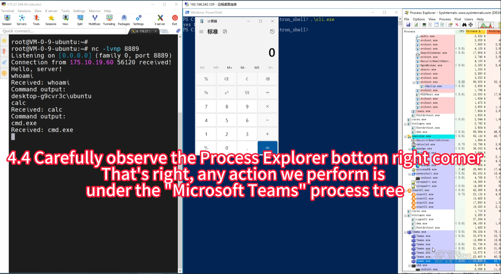
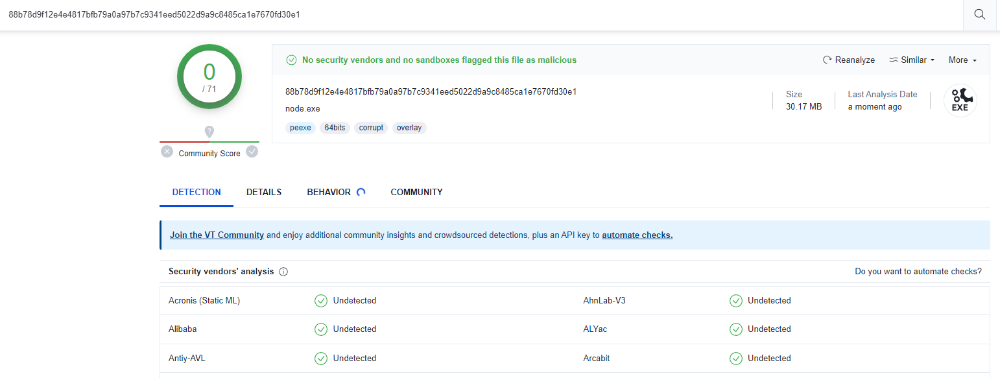

<p align="center">
  
</p>


<h1 align="center">Electron_shell</h1>

<div align="center">
Developing a more covert Remote Access Trojan (RAT) tool by leveraging Electron's features for command injection and combining it with remote control methods.<br>
利用Electron桌面程序的白特征执行黑命令，一种隐蔽的远程访问特洛伊木马（RAT）寄生工具。</div>


## 🖥Video Demo

[](https://djerryz-docs-1258823000.cos.ap-shanghai.myqcloud.com/github/electron_shell/electron_shell_demo.mp4)

also: https://djerryz-docs-1258823000.cos.ap-shanghai.myqcloud.com/github/electron_shell/electron_shell_demo.mp4


## ✨ Features

- 🌈 Supports almost all operating systems

  - mac
  - linux
  - windows

- 📦 Supports almost all desktop applications developed based on Electron

  - QQ
  - Microsoft Team
  - Discord
  - GitHubDesktop
  - 淘宝直播
  - vscode
  - and more (https://en.wikipedia.org/wiki/List_of_software_using_Electron)

- 🎨 All malicious operations are executed by the injected program, those commonly used trusted programs

- Bypass of Network Access Control Policy for Applications by Zero Trust Sandbox

- ⚙️ Verified that it will not be discovered by the antivirus software below

  (**Please note that a simple command call has been implemented here, and some behavior based heuristic checks will still prompt , bypass AV is not a key issue to be addressed in this project**)

  - Windows Defender

  - avast

  - 火绒

  - 360

  - 腾讯管家

  - virustotal
    


## 🎉Intro

An increasing number of desktop applications are opting for the Electron framework. 

Electron provides a method that can be debugged, usually by utilizing Chrome's inspect function or calling inspect through Node.js. In this project, the implementation of inspect was analyzed, and a method for automatically parasitizing common Electron programs was developed.

By establishing a connection with the Command and Control (C2) server, a simple remote control is achieved.  

Due to the widespread trust of most antivirus software in  these well-known applications (with digital signatures), executing  malicious commands in the program context provides excellent concealment and stability.  

For these injected applications, it is necessary to carefully consider the potential legal risks brought by such actions. When users analyze program behavior, they may be surprised to find that the parent process executing malicious behavior comes from the application they trust.


## 🔨 Usage

### C2 Server Setup

1. Deploy a server and obtain a public IP address
2. and then exec command:   `nc -lvnp 8899`

### Generating Implants

1. clone this project

2. modify build.config
   
    ```
    injected_app:  The electron program you want to inject
    c2:            set c2_Public IP and c2_netcat Port
    ```
    
3. exec `node build.js`, and then pkg to an execute program

4. Send to victim, and get **electron_shell** ❤️


## 🤝License - GPLv3

Electron_shell is licensed under [GPLv3](https://www.gnu.org/licenses/gpl-3.0.en.html), some sub-components may have separate licenses. See their respective subdirectories in this project for details.